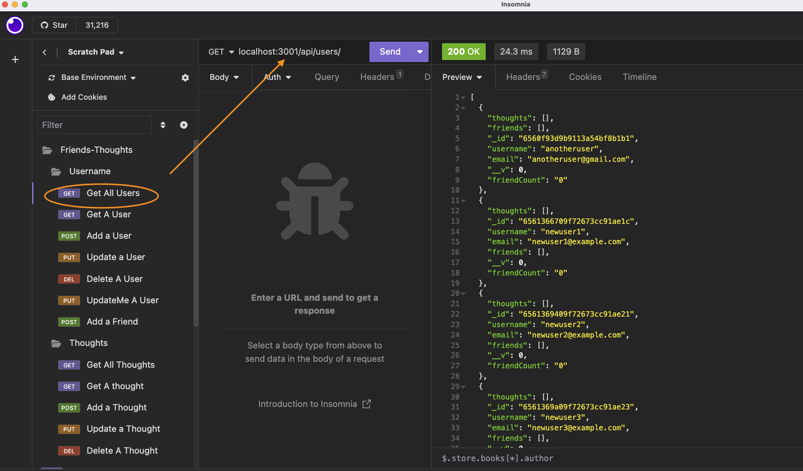
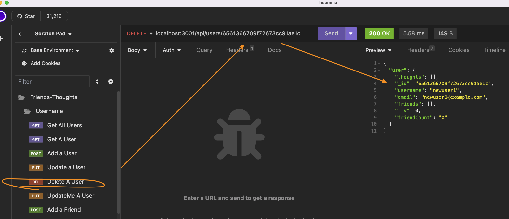
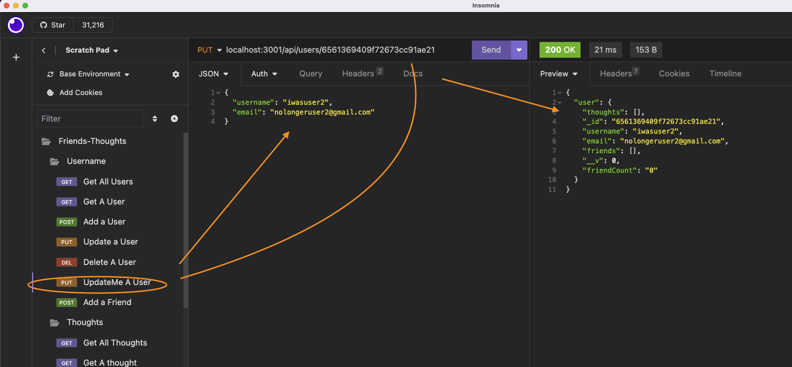
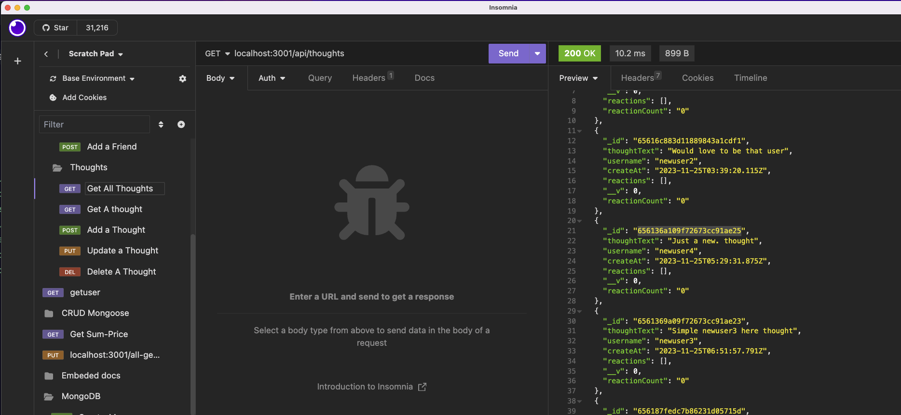
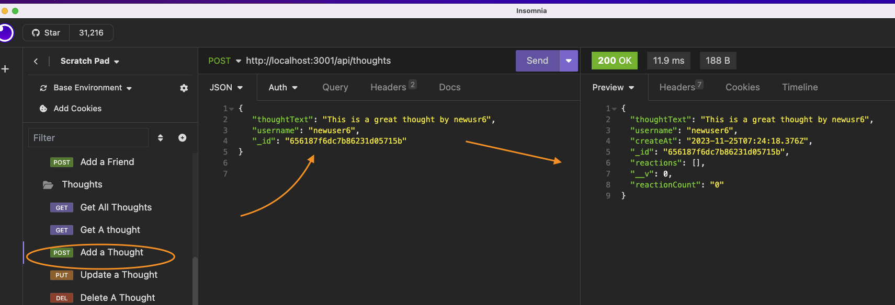
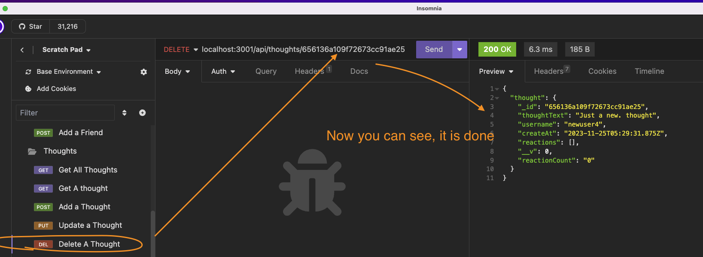

# friends_and_thoughts

This API is to mimic the interactions between users and their friends in a Social Networking environment. 

## Description and Motivation

As a user, I would want to be able to add my username to a "Meet with Friends" - type Social media network so that I can share thoughts with them.
With this API, The user will be able to share and receive "thought" (comments from friends). They can also create a friends list, and manage the thoughts and friends by changing or deleting them.

### The following is a link to the video of the application's functionality:
Video update is: https://drive.google.com/file/d/1iM4ztTg5A3WILhPJoiaBqJ88-tZ1j3xU/view

### Just to see how it will look using Insomnia, here is a snippet of all users:

. 

## Usage

Since this is an API, it is created with the user in mind who wishes to implement it. Simply do the following and you will be able to build and use this for yourself.

* First, clone this repo to your desktop somewhere.
* Next, you need to install the libraries and dependencies required to run it
  * cd <repo_location>
  * npm install
  * npm run start
* Your application will now run. All you will need to do is use something like Insomnia (or another app that can use this API) to interact with the application and add your user data there.

## Table of Contents

* [Technology Used](#technology-used)
* [Repo Location](#repo)
* [Screenshots of Application](screenshots-of-application)
* [Learning Points](#learning-points)
* [Code Snippets](#code-snippets)
* [Contact Info](#contact-info)

## Technology Used 

| Technology Used         | Resource URL           | 
| ------------- |:-------------:| 
| Video: Screencastify Extension | [https://chromewebstore.google.com/detail/screencastify-screen-vide/mmeijimgabbpbgpdklnllpncmdofkcpn](https://chromewebstore.google.com/detail/screencastify-screen-vide/mmeijimgabbpbgpdklnllpncmdofkcpn)     |    
| Mongoose | [https://mongoosejs.com/docs/index.html](https://mongoosejs.com/docs/index.html)     |    
| Git | [https://git-scm.com/](https://git-scm.com/)     |    
| NPM and ExpressJs | [https://www.npmjs.com/package/express](https://www.npmjs.com/package/express)|
| NodeJs | [https://nodejs.org/en](https://nodejs.org/en)|
| w3schools | [https://www.w3schools.com/](https://www.w3schools.com/)|
| ChatGPT | [https://openai.com/blog/chatgpt](https://openai.com/blog/chatgpt)|

There is also javascript, Google Search, and Youtube university. 
## Repo 

[GitHub Repo for Friends n Thoughts](https://github.com/flimits/friends_and_thoughts)

## Screenshots of Application
---
To get a better picture of what it is doing, or going to do, here are three snapshots to look at.

### Here is the opening page.

---
---
### Here is deleting a new user

---
---
### Here is updating a new user

---
---
### Here is all a thoughts

---
---
### Here is add one a new thought

---
---
### Here is delete one a new thought

---
---
### There is a lot of functionality here. this is just  a sample
---

## Learning Points and Lessons learned

This was a great oportunity to learn Mongoose and Mongodb. I was excited to get it in place and start working on it

## Code Snippets

## Contact Info

| Name      |Email      | Github    | Portfolio |
|-----------|-----------|-----------|-----------|
|Jason       |flimits@gmail.com|https://github.com/flimits|https://github.com/flimits/my-portfolio/|

# PSUEDO Coding out 18 NoSQL: Social Network API
1. Set up config - (make sure MONGOOSE connection are good).
2. Set up route directory with CONTROLLERS and ROUTES in it.
3. Set up Model directory
4. Set up Utils directory
5. Set up NPM - express , mongoose, nodemon --watch
6. Create Server.js
Model User
- username
- email
- thoughts ( ref 'thought')
- friends ( ref 'User')
- virtual friendCount - going to have a function to calculate length of the FRIEND array.
Model Thought
- thoughtText
- createdAt
- username ( ref 'userId' )
- reaction ( array of reactionId references )
(doesn't have to be a model, has to be a schema)
- virtual reactionCount - going to have a function
to get the length of REACTIONS array
Schema Reaction
- Id
- body
- username
- createdAt
This will not be a model, but rather will be used as the `reaction` field's subdocument schema in the `Thought` model.
API Routes
User route
- get 1 findOne({ })
- get all find({ })
- put findOneAndUpdate({ })
- create create(req.body)
- delete findOneAndDelete({ })
- POST findOneAndUpdate {$AddtoSet { }}
- DELETE for friend request findOneAndUpdate {$pull} {new True}
Thought route
- get 1
- get all
- put
- create
- delete
- ADD / DELETE Reaction
CONTROLLER
Interact with the model
modules.export = findAll(user)
ROUTES interact with the Database
render user
